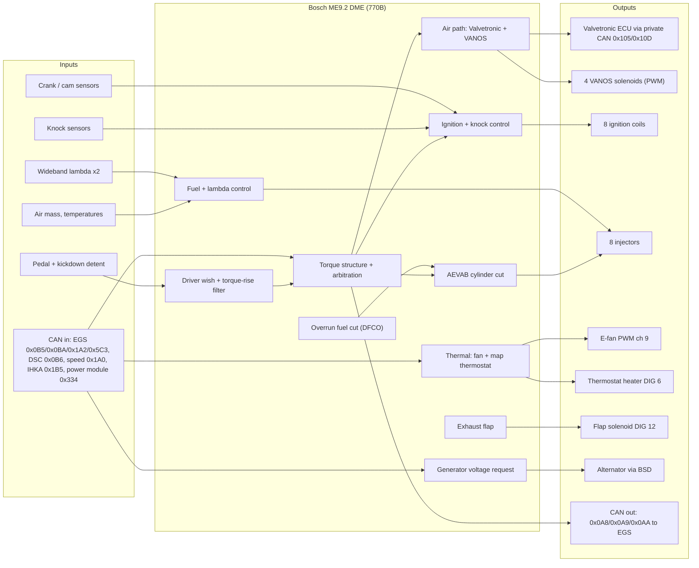
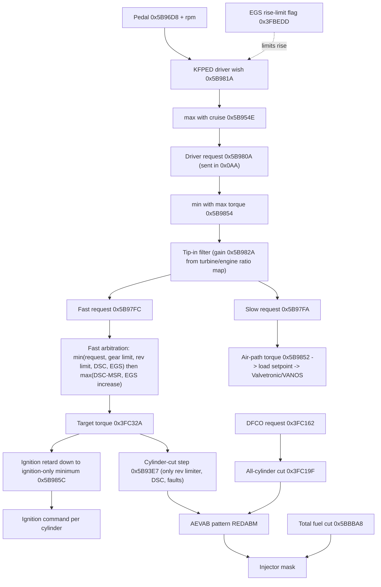
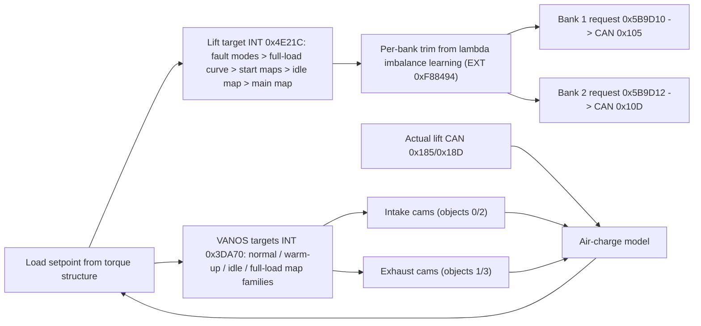
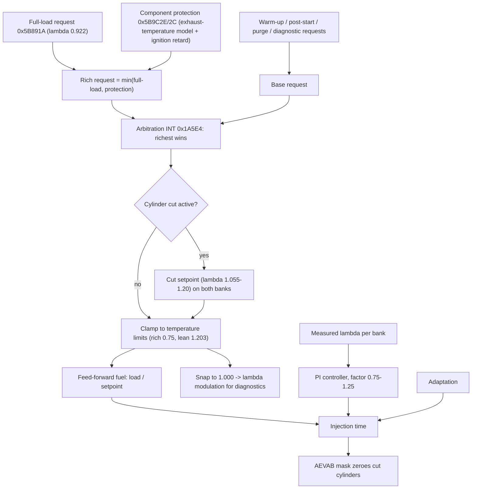
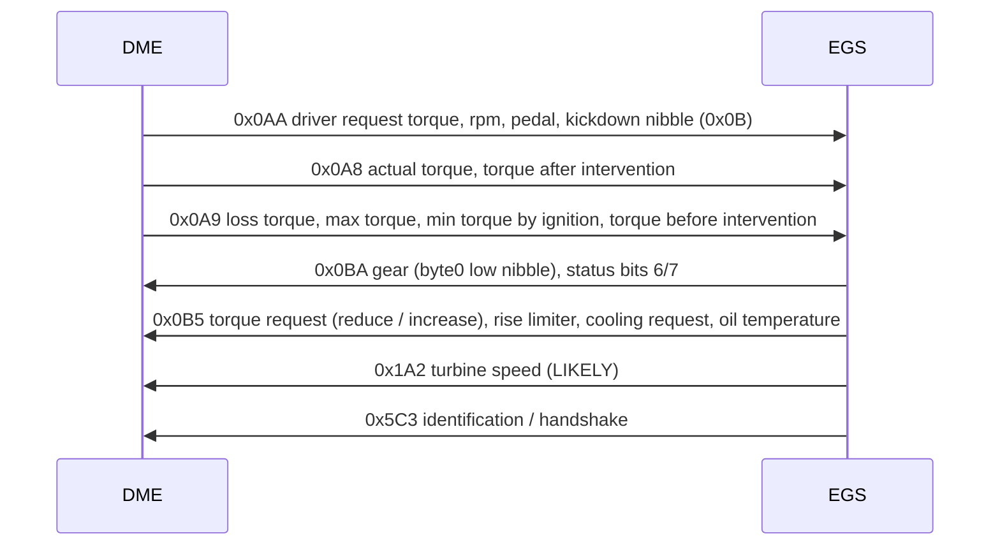
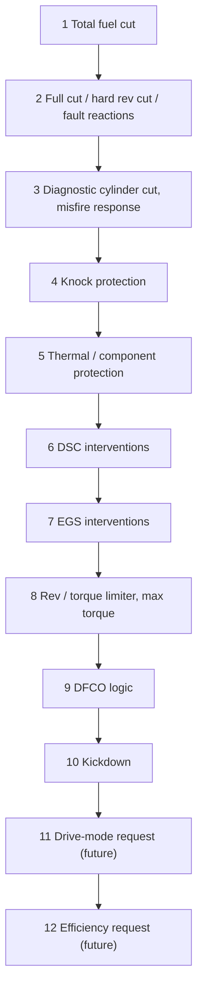

# System flow — how the 770B DME works and what depends on what

This page is the map of the whole system as reconstructed by static analysis of the BMW E65 735i
(N62B36) Bosch ME9.2 DME, SW `1037389760`. Every block links to the detailed note ("Read more").
Status words follow the project confidence model (CONFIRMED, HIGH CONFIDENCE, LIKELY, HYPOTHESIS).
Diagrams render on GitHub (Mermaid). Clicking a node opens its note; if your viewer blocks diagram
links, use the "Read more" table under each diagram.

Contents:
1. [Big picture](#1-big-picture)
2. [Torque path: from pedal to spark and injector](#2-torque-path-from-pedal-to-spark-and-injector)
3. [Air path: Valvetronic and VANOS](#3-air-path-valvetronic-and-vanos)
4. [Fuel and lambda path](#4-fuel-and-lambda-path)
5. [DME ↔ EGS communication](#5-dme--egs-communication)
6. [Thermal, electrical and exhaust flap](#6-thermal-electrical-and-exhaust-flap)
7. [Protection priority stack](#7-protection-priority-stack)
8. [Dependency matrix: what depends on what](#8-dependency-matrix-what-depends-on-what)
9. [What can be done where](#9-what-can-be-done-where)
10. [Five situations, step by step](#10-five-situations-step-by-step)

---

## 1. Big picture



**How to read it:** the driver asks for torque with the pedal. The DME turns that into a torque
request, limits and shapes it, and then decides how to deliver it: slowly through air (Valvetronic
lift, VANOS cam timing) and quickly through ignition angle and, in rare interventions, by cutting
injectors. Lambda control meters fuel to the air. The EGS (gearbox computer) receives the torque
numbers and can ask the DME for less or more torque during shifts. Thermal, electrical and flap
functions run alongside.

| Block | Status | Read more |
|---|---|---|
| Memory map, tooling, verification | CONFIRMED | [verified-findings](../research/verified-findings.md), [tools](../tools/README.md) |
| Driver wish + torque-rise filter | CONFIRMED | [egs-tcc-shift-state](../research/egs-tcc-shift-state.md), [torque-and-modes](../research/torque-and-modes.md) |
| Torque structure + arbitration | CONFIRMED | [torque-and-modes](../research/torque-and-modes.md) |
| Air path | CONFIRMED structure, LIKELY units | [valvetronic](../research/valvetronic.md), [vanos](../research/vanos.md) |
| Ignition + knock | CONFIRMED structure | [ignition-knock-fuel-quality](../research/ignition-knock-fuel-quality.md), [late-ignition-and-catalyst-heating](../research/late-ignition-and-catalyst-heating.md) |
| Fuel + lambda | CONFIRMED | [lambda-control](../research/lambda-control.md), [full-load-enrichment](../research/full-load-enrichment.md), [cylinder-cut-lambda](../research/cylinder-cut-lambda.md) |
| AEVAB cylinder cut | CONFIRMED | [aevab-redabm](../research/aevab-redabm.md), [aevab-integration-points](../research/aevab-integration-points.md) |
| DFCO | CONFIRMED | [overrun-dfco](../research/overrun-dfco.md) |
| Thermal | HIGH CONFIDENCE | [thermal-management](../research/thermal-management.md) |
| Generator | CONFIRMED / HIGH CONFIDENCE | [generator-control](../research/generator-control.md) |
| Exhaust flap | CONFIRMED / HIGH CONFIDENCE | [exhaust-flap](../research/exhaust-flap.md) |
| CAN interface | CONFIRMED | [dme-egs-interface](../research/dme-egs-interface.md), [can-and-drive-modes](../research/can-and-drive-modes.md) |

---

## 2. Torque path: from pedal to spark and injector



Key facts (CONFIRMED in code): reductions are `min`, increases are `max` and win over reductions;
every fast reduction goes to ignition first; only the rest becomes a cylinder cut, and only for rev
limiter, DSC and fault reactions. EGS reductions never cut cylinders on their own. Total fuel cut is
applied last and overrides everything. [Read more →](../research/torque-and-modes.md)

---

## 3. Air path: Valvetronic and VANOS



* Valvetronic: one lift request per bank, no per-cylinder control (CONFIRMED). Lift in µm (HIGH
  CONFIDENCE). [Read more →](../research/valvetronic.md)
* VANOS: 4 cams, objects 0/2 intake and 1/3 exhaust (HIGH CONFIDENCE); which pair is bank 1 needs a
  live log. Angles 0.1 °CA. [Read more →](../research/vanos.md)

---

## 4. Fuel and lambda path



Component protection is always at least as rich as full-load (CONFIRMED). The λ = 1 window only
switches the λ modulation used by diagnostics, not the controller (correction of round 4).
[Read more →](../research/lambda-control.md)

---

## 5. DME ↔ EGS communication



Torque scaling on CAN: `(T − loss) · 36/2048`, signed 12-bit (CONFIRMED ratio); Nm per bit is not
provable from the DME alone (0.5 Nm/bit is a HYPOTHESIS). The DME has no D/S/M program state (HIGH
CONFIDENCE). [Read more →](../research/dme-egs-interface.md) · [Turbine speed →](../research/egs-tcc-shift-state.md)

---

## 6. Thermal, electrical and exhaust flap

```mermaid
flowchart LR
  CT2["Second coolant sensor 0x5B9308"] --> FANR["Fan request = max(coolant term, A/C term) + gearbox-oil term, x speed factor"]
  IHKA["IHKA stage 0x5B854A (CAN 0x1B5)"] --> FANR
  OIL["Gearbox oil temperature 0x5B9229"] --> FANR
  SPD["Vehicle speed 0x5B90BB"] --> FANR
  FANR --> FAN["E-fan PWM ch 9 (100 Hz, after-run 10 Hz 20 %)"]
  MAPS["Coolant target maps (speed x intake temp, speed x load)"] --> TGTC["Coolant target"]
  EGSC["EGS or IHKA cooling request"] -. forces 84.75 C .-> TGTC
  TGTC --> HTR["Thermostat heater DIG 6 (two-point control)"]
  PM["Power module request CAN 0x334"] --> VREQ["Generator voltage request (mV)"]
  VREQ --> BSD["BSD frame to alternator"]
  BSD --> GT["Generator torque model -> idle torque reserve"]
  GEAR["Gear x rpm threshold map"] --> FLP["Flap command (1 = closed)"]
  PEDF["Pedal or cruise pedal"] --> FLP

  click FANR "https://github.com/jefafafah/BMW-N62-ME9.2-Research/blob/main/research/thermal-management.md"
  click HTR "https://github.com/jefafafah/BMW-N62-ME9.2-Research/blob/main/research/thermal-management.md"
  click VREQ "https://github.com/jefafafah/BMW-N62-ME9.2-Research/blob/main/research/generator-control.md"
  click FLP "https://github.com/jefafafah/BMW-N62-ME9.2-Research/blob/main/research/exhaust-flap.md"
```

[Thermal →](../research/thermal-management.md) · [Generator →](../research/generator-control.md) · [Exhaust flap →](../research/exhaust-flap.md)

---

## 7. Protection priority stack



Ranks 1–9 are OEM and stay untouched; future mode and efficiency requests are always lowest.
[Read more →](../research/protection-priority.md)

---

## 8. Dependency matrix: what depends on what

Read across: the row subsystem **depends on** the marked inputs.

| Subsystem ↓ / depends on → | Pedal | rpm | Gear (EGS) | Turbine speed | Load / air model | Temperatures | Lambda | Knock | Vehicle speed | DSC/EGS torque | Battery/power module |
|---|---|---|---|---|---|---|---|---|---|---|---|
| Driver wish | ● | ● | | | | | | | | rise limiter | |
| Torque-rise filter | | ● | ● | ● | | | | | | | |
| Torque arbitration | ● | ● | ● (gear limit) | | ● | | | | | ● | |
| Valvetronic | ● (fault mode) | ● | | | ● | ● (start) | ● (bank balance) | | | | |
| VANOS | | ● | | | ● | ● (warm-up) | | | | | |
| Ignition | | ● | | | ● | ● (IAT, warm-up) | | ● | | ● (via target) | |
| Lambda | | ● | | | ● | ● (limits, protection) | ● | | | | |
| AEVAB | | ● | | | ● | | | | | ● | |
| DFCO | ● | ● | (mask, all allowed) | | | ● | | | ● (hysteresis) | ● (blocks) | |
| Fan | | | | | | ● | | | ● | | ● (voltage comp.) |
| Thermostat | | ● | (EGS request) | | ● | ● | | | ● | | |
| Generator | | ● | | | ● | ● | | | ● (relief) | | ● |
| Exhaust flap | ● | ● | ● | | | ● (gate) | | | ● (standstill) | | |

---

## 9. What can be done where

| Subsystem | What exists (OEM) | What future work could do | Prerequisite | Read more |
|---|---|---|---|---|
| Driver wish / filter | KFPED, EGS rise limiter, tip-in filter with ratio map | mode-specific pedal feel and smoothing (E/D/S/M) | mode-signal source; Stage 4/5 validation | [final-mode-architecture](../research/final-mode-architecture.md) |
| Torque structure | full arbitration chain, CAN torque words | nothing in protections; keep CAN torque consistent | Nm/bit live check | [torque-and-modes](../research/torque-and-modes.md) |
| Valvetronic | lift maps, full-load curve, bank balance | part-load efficiency (E), earlier full lift (S) | unit confirmation, Stage 2 | [valvetronic](../research/valvetronic.md) |
| VANOS | 2 families × 2 cam types, full-load maps | part-load overlap (E), full-load timing (S) | bank assignment, Stage 2 | [vanos](../research/vanos.md) |
| Ignition | base/full-load/idle maps, knock control | only where knock margin exists; knock control stays | 95/98 RON knock logs | [ignition-knock-fuel-quality](../research/ignition-knock-fuel-quality.md) |
| Lambda | richest-wins arbitration, protection on top | stock λ 1 for E; stock enrichment logic for S | — | [lambda-control](../research/lambda-control.md) |
| DFCO | complete state machine | earlier entry / lower resume within drivability | DFCO logs | [overrun-dfco](../research/overrun-dfco.md) |
| Generator | voltage request, relief levels, disabled full-load relief | load shifting (E), full-load relief (S) | battery logs | [generator-control](../research/generator-control.md) |
| Thermal | map thermostat, fan PWM | part-load target (E), earlier low target (S) | warm-up logs | [thermal-management](../research/thermal-management.md) |
| Exhaust flap | gear × rpm pedal thresholds | different thresholds per mode | polarity bench check | [exhaust-flap](../research/exhaust-flap.md) |
| EGS / transmission | DME side decoded; shifting is in the EGS | earlier lock-up / upshift (largest efficiency lever) | **EGS firmware** | [dme-egs-interface](../research/dme-egs-interface.md) |
| Cylinder cut (ECO) | AEVAB as torque intervention | optional manual experiment only | all other stages done; emissions/NVH measurement | [firing-density-feasibility](../research/firing-density-feasibility.md) |

Process for any of this: [development methodology](../research/development-methodology.md) →
[in-car validation plan](../research/in-car-validation-plan.md) → [efficiency budget](../research/efficiency-budget.md).

---

## 10. Five situations, step by step

**Light throttle tip-in (D, 3rd gear, converter locked).** The pedal rises → KFPED wish rises → if
the EGS has set its rise-limit bit, the wish may only climb by a small step per cycle → driver
request → capped by max torque → the tip-in latch sets because the request jumped above the filtered
value → the second-order filter smooths the torque rise; with engine and turbine speed equal (ratio
1.00–1.04) the ratio map makes the filter about 1.5× slower (more smoothing) → the slow path raises
lift and adjusts VANOS, the fast path keeps ignition near base → no cylinder cut. (CONFIRMED logic,
LIKELY interpretation.)

**Kickdown.** Pedal 100 % plus the detent voltage → `B_kd` = 1 → the DME sends nibble 0x0B in 0x0AA
→ the EGS downshifts; inside the DME there is no extra torque path, the flap opens because the
pedal value exceeds every threshold, and full-load maps engage through the normal full-load flag.
(CONFIRMED.)

**Cylinder cut (DSC traction event).** DSC sends a torque reduction (0x0B6 LIKELY) → fast target
drops → ignition retards down to the ignition-only minimum → the rest becomes an AEVAB step (DSC is
an allowed enable) → REDABM pattern cuts N cylinders → the lambda setpoint of both banks switches to
the cut curve, the cut bank goes open loop → when DSC releases, the step returns to 0 and lambda
release waits for an air-mass integral. (CONFIRMED.)

**Turbine speed approaches engine speed (converter locking).** 0x1A2 speed / engine speed rises
from about 0.9 to 1.0 → below 0.96 the ratio map makes the tip-in filter faster (less smoothing,
the converter damps), at 1.00–1.04 it makes it slower (stiffer driveline) → no lock-up flag exists
in the DME; the EGS decides lock-up. (CONFIRMED map, LIKELY meaning.)

**Coolant and load rise (towing uphill).** Full-load flag sets → full-load lift/VANOS/ignition maps
and λ 0.922 → the exhaust-temperature model rises → protection lambda blends richer, also driven by
ignition retard → knock control retards individual cylinders when needed → the coolant target is taken
from the full-load target map → the thermostat heater energises when the engine is hotter than that target → fan duty rises with the second
coolant sensor and gearbox-oil temperature. (CONFIRMED structure, values LIKELY.)
