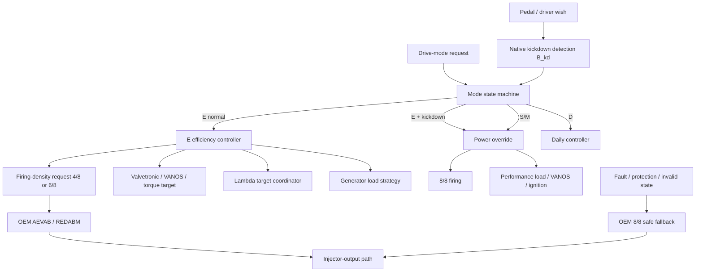

# Proposed powertrain architecture

## Principle

Reuse OEM Bosch mechanisms where they already solve difficult real-time problems (injector sequencing, kickdown state, knock adaptation, generator load handling, lambda recovery, fault fallback) and add as little custom logic as possible.

## Priority rules

1. OEM engine protection and fault handling always wins.
2. OEM DSC/EGS torque interventions must remain functional.
3. E-mode efficiency logic is allowed only when all prerequisites are valid.
4. Native kickdown overrides E-mode firing limits temporarily.
5. When kickdown ends, the mode request remains latched and the controller returns to E after a stabilization timer/hysteresis.

## Why dynamic/rotating firing density

The N62 does not close intake/exhaust valves on deactivated cylinders. Keeping the same four cylinders unfired for long periods would continue pumping air through them and create bank/lambda/thermal complications. Alternating OEM masks can keep all cylinders thermally active while reducing firing density.
