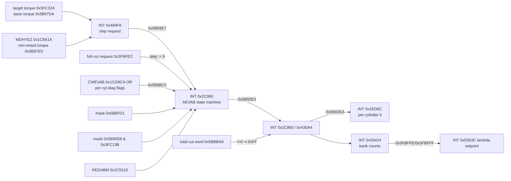

# AEVAB / REDABM — selective injector shutoff in 770B

> **Final-pass status:** logic CONFIRMED and unchanged. Intervention-source names were resolved in the final pass (`torque-and-modes.md` §3, `protection-priority.md`).


Target: SW `1037389760` (family `0087180A770B`), HW `0261209002`.
Address conventions: **CPU** = MPC555 address as used by code; calibration is read through the
CPU alias `0x1C0000–0x1DFFFF` (= external-flash file offset `CPU − 0x100000`, same bytes as CPU
`0xFC0000–0xFDFFFF`). **INT** = internal-flash CPU address (= file offset in `mpc555-6.bin`).
RAM addresses (`0x3Fxxxx` internal SRAM, `0x5Bxxxx` external RAM) are runtime-only.

Reproduce every claim marked CONFIRMED with `tools/verify_770b_findings.py`; inspect code with
`tools/me9_xref.py dis <start> <end>`.

## 1. Verdict on the round-1 hypothesis

| Claim | Status | Evidence |
|---|---|---|
| `REDABM` contains balanced 4-of-8 masks `0x55`/`0xAA` | **CONFIRMED** | column 4 of the 8×8 matrix at CPU `0x1C5510` contains only `0x55`/`0xAA`; every column *k* has exactly *k* bits set |
| `REDABM` is actually used by the 770B code | **CONFIRMED** | INT `0x2C560` and `0x2C6E4`: `addi rX, r2, -0x2AE0` → `0x1C5510`, then `lbzx` with row/column index |
| Mask bit *n* = cylinder *n* | **REJECTED** | bit *n* = *n*-th cylinder **in firing order 1‑5‑4‑8‑6‑3‑7‑2** (see §4) |
| `0x55` = cylinders 1,3,5,7 | **REJECTED** | `0x55` cuts cylinders **1,4,6,7**; `0xAA` cuts **5,8,3,2** — two per bank each, even 180° firing spacing |
| OEM logic rotates the pattern continuously (skip-fire) | **REJECTED** for OEM behaviour | the REDABM row (phase) is latched when a reduction event starts and is not advanced while the event lasts (§3) |
| Bit = 1 means "cylinder cut" | **CONFIRMED** | injection-time loop INT `0x2EF40`: bit set → injection time 0 |

## 2. Runtime chain



Call site: task function `0x31B20` calls `0x2C060` (AEVAB) and `0x2C860` (output) back-to-back at
INT `0x31B80/0x31B84`, followed by the injection-time function `0x2ED6C` at `0x31B8C`. The task is
registered in the OS task table at INT `0x6F878`. Its rate (segment-synchronous vs. fixed time) is
**not yet determined**.

## 3. State machine (INT `0x2C060`) — CONFIRMED from disassembly

Inputs per call:

* `N` = step `0x5B92E6` = `8` if `0x3FBFEC` (full-cut request) else `0x5B93E7` (step request).
* `S` = "static cut active" = `0x5B88C5 ≠ 0` **or** `0x5B8FD1 ≠ 0` **or** (`0x5B90D8 ≠ 0` and `0x3FC13B`).
* phase `P` = `0x5B92E4`, state `0x5B92E8`, pattern mask `0x5B92E5`, static mask `0x5B92E1`,
  post-event counter `0x5B92E9`.

```text
on entry to a reduction (state 0→3, 1→2, 4→3):
    P := (segment_counter[0x5B907C] + 4) & 7        # latched once per event

state 0 idle      : N>0 → 3 (latch P) ; elif S or 0x3FBFEB or 0x3FC234 → 5
state 3 pattern   : S → 2 ; elif N==0 → 4 (mask := 0, counter := 0)
state 2 pat+static: !S && hold(0x5B92E2)==0 → 3 ; elif N==0 → 5
state 1 static    : N>0 → 2 (latch P) ; elif !S && hold==0 → 4
state 4 recovery  : N>0 → 3 (latch P) ; elif 0x5B8FD1≠0 → 5 ; elif counter >= 16 → 0
                    (note: only 0x5B8FD1, not the full S, is checked in state 4)
state 5           : init static-cut bookkeeping, → 1

outputs (second switch in the same function):
state 3: mask = REDABM[P][N-1]
state 2: mask = REDABM[P][N-1] | static
state 1: mask = static (0x5B88C5 | 0x5B8FD1 | [0x5B90D8 if 0x3FC13B]);
         alt. path when 0x3FC234: mask = 0x5B90F9 with countdown 0x5B92E2 = 0x5B90F3*8
state 4: counter++ (mask stays 0)
```

Consequences:

* **Runtime mask selection (answer to the round-2 question):** `mask = REDABM[(segment + 4) mod 8][N − 1]`,
  with the row latched at the start of a reduction event and the column following the current step
  on every call. While a constant step persists, the same cylinders stay cut.
* Different events start at different crank segments, so over many events the cut cylinders are
  distributed. This is event-random distribution, not a per-cycle rotating skip-fire.
* `+4` places the first cut half a cycle (four segments, 360° CA) ahead of the cylinder being
  prepared. **HYPOTHESIS:** this gives injection-timing headroom.

## 4. Bit order = firing order — CONFIRMED

* The injection-time loop (INT `0x2EF24…`) iterates `n = 0..7`. When bit *n* of `0x5B92EA` is
  set, the injection time is 0. Otherwise it takes the bank-2 time if bit *n* of constant `0x5A`
  is set, else the bank-1 time.
* The bank mask `0x5B8C82` is initialised to `0x5A` at EXT `0xFE4BF4` and used by the per-bank
  counter (INT `0x55424`).
* `0x5A` = positions 1,3,4,6. With firing order 1‑5‑4‑8‑6‑3‑7‑2 these are cylinders 5,8,6,7, i.e.
  exactly bank 2 (BMW: cylinders 1–4 bank 1, 5–8 bank 2). With cylinder-number bit order the bank-2
  mask would be `0xF0`. The firing-order interpretation is therefore the only consistent one.

REDABM decoded to cylinder numbers (rows = latched phase P, columns = step N):

| row (phase) | step 1 | step 2 | step 3 | step 4 | step 5 | step 6 | step 7 | step 8 |
|---|---|---|---|---|---|---|---|---|
| 0 | 01: 1 | 11: 1,6 | 15: 1,4,6 | 55: 1,4,6,7 | 57: 1,4,5,6,7 | 77: 1,3,4,5,6,7 | 7F: 1,3,4,5,6,7,8 | FF: all |
| 1 | 02: 5 | 22: 3,5 | 2A: 3,5,8 | AA: 2,3,5,8 | AB: 1,2,3,5,8 | BB: 1,2,3,5,6,8 | BF: 1,2,3,4,5,6,8 | FF: all |
| 2 | 04: 4 | 44: 4,7 | 54: 4,6,7 | 55: 1,4,6,7 | 57: 1,4,5,6,7 | 77: 1,3,4,5,6,7 | 7F: 1,3,4,5,6,7,8 | FF: all |
| 3 | 08: 8 | 88: 2,8 | A8: 2,3,8 | AA: 2,3,5,8 | BA: 2,3,5,6,8 | BB: 1,2,3,5,6,8 | FB: 1,2,3,5,6,7,8 | FF: all |
| 4 | 10: 6 | 11: 1,6 | 51: 1,6,7 | 55: 1,4,6,7 | 75: 1,3,4,6,7 | 77: 1,3,4,5,6,7 | F7: 1,2,3,4,5,6,7 | FF: all |
| 5 | 20: 3 | 22: 3,5 | A2: 2,3,5 | AA: 2,3,5,8 | EA: 2,3,5,7,8 | EE: 2,3,4,5,7,8 | EF: 1,2,3,4,5,7,8 | FF: all |
| 6 | 40: 7 | 44: 4,7 | 45: 1,4,7 | 55: 1,4,6,7 | D5: 1,2,4,6,7 | DD: 1,2,4,6,7,8 | BF: 1,2,3,4,5,6,8 | FF: all |
| 7 | 80: 2 | 88: 2,8 | 8A: 2,5,8 | AA: 2,3,5,8 | AB: 1,2,3,5,8 | BB: 1,2,3,5,6,8 | BF: 1,2,3,4,5,6,8 | FF: all |

Observations:

* Step 2 always cuts two cylinders 360° apart, and step 4 always cuts two per bank: OEM
  NVH/lambda balancing.
* **CONFIRMED data, unexplained:** row 6 step 7 (`0xBF`) is not a superset of row 6 step 6 (`0xDD`).
  Cylinder 7 is re-enabled while 1,3,5 are cut. The matrix is byte-identical to the 560B reference,
  so this is Bosch base data, not a 770B change.

## 5. Step request (INT `0x484F8`) — CONFIRMED logic, names HYPOTHESIS

```text
x      = 0x5B97E0 * 0x3FC2F9 / 200                     # torque reachable without cut (scaled)
if 0x3FC195: x = max(0, x - CAL[0x1C8A19]*256)
blank_block(0x3FC19E) : x >= target(0x3FC32A) → 0 ; x + MDHYEZ(0x1C8A1A)*256 <= target → 1  (hysteresis)

full_cut(0x3FC19F) = (cw 0x1C8A18 bit1 ? 0x5B92EC >= CAL[0x1C8A1D] : !blank_block)
                     && 0x3FC162 && !0x3FC198 && !0x3FBEB8
if full_cut: step(0x5B93E7) = 8 ; return

ideal = (1 - target/base(0x5B97DA)) * 8000              # "cylinders x 1000"   (0x5B985E)
off   = (step_prev*1000 - ideal >= CAL[0x1C8A1B]*20) ? CAL[0x1C8A1C] : CAL[0x1C8A1B]
n     = (ideal + off*20) / 1000                          # 0x5B93E6 (rounded with hysteresis)
enable= 0x3FBF38 || 0x3FC1A3 || 0x3FBF34 || (0x3FC195 && cw.bit0) || (0x3FC162 && cw.bit1)
step  = (enable && n >= 0x5B93E8 && !blank_block) ? min(n, 8) : 0
```

Interpretation (**LIKELY**): injector shutoff is used only when the requested torque reduction
exceeds what the faster path (ignition retard) can deliver. The cut count is the nearest integer to
8 × (1 − target/base), which is what a torque-per-cylinder model predicts. The enable flags are the
intervention sources. **HYPOTHESIS:** they are ASC/DSC requests (`0x3FBF34/0x3FBF38`, written by INT
fn `0x404D4`), EGS/shift or limiter requests (`0x3FC1A3`, `0x3FC195`, `0x3FC162`). Their individual
identity is open.

## 6. Full and total cutoff — CONFIRMED logic

* INT `0x42FC4`: `0x3FBFEC` (full cut via AEVAB, step 8) = (`0x3FBF38` && `0x5B9001 > CAL[0x1C5550]`)
  ∨ (`0x3FC1A4` && `0x3FBF34`). `0x3FBFED` = `0x3FBFEC` ∨ `0x3FBFEE`.
* INT `0x430A4`: `0x5BBBA8` collects total-cut reasons as bits (`0x80` ← `0x3FB830.1`, `0x02` ← `0x3FBFED`,
  `0x04` ← `0x3FBEFF`, `0x08` ← `0x3FC247`, `0x100` ← `0x3FBE99`, `0x100` also set by `0x431EC`). Any
  bit set forces the final mask `0x5B92EA = 0xFF`.
* `0x3FBFEF` = "neither pattern nor total cut active".

`EVZ_AUSTOT` ↔ `0x5BBBA8` and `EVZ_AUS` ↔ `0x5B92EA` are name **candidates** (HYPOTHESIS / LIKELY).
Their function is CONFIRMED.

## 7. Static masks

| Mask | Source | Status |
|---|---|---|
| `0x5B88C5` | EXT `0xF7BEE4`: 8 per-cylinder flags at `0x3FE3A9 + 2n` (bit 0 each) → `0x5B88C4`, then `\| CWEVAB (0x1CD9CA)` | CONFIRMED |
| `0x5B8FD1` | EXT fn `0xF37E34` (bit-builder from `0x3FE40F…`) | CONFIRMED source fn, meaning open |
| `0x5B90D8` | EXT fns `0xF1F2EC`, `0xF2E2C8`, `0xF40DD0`, `0xF876C8`, gated by `0x3FC13B` | meaning open |

**CWEVAB** (`0x1CD9CA`, stock `0x00`): a static, mode-independent permanent cut mask in firing-order
bit order. It is **not** suitable for an E-mode (always active, enters the "static" branch and
lambda handling).

## 8. Names requested in the brief

| Name | 770B result | Status |
|---|---|---|
| AEVAB | function INT `0x2C060` (+ output `0x2C860`) | HIGH CONFIDENCE |
| REDABM | CPU `0x1C5510` (file `0xC5510`) | CONFIRMED |
| CWEVAB | CPU `0x1CD9CA` (file `0xCD9CA`) | HIGH CONFIDENCE name, CONFIRMED function |
| STATEAEVAB | RAM `0x5B92E8` | HYPOTHESIS name, CONFIRMED function |
| REDSOL / REDSOLR | RAM `0x5B93E7` (applied) / `0x5B93E6` (rounded) | HYPOTHESIS |
| EVZ_AUS | RAM `0x5B92EA` | LIKELY |
| EVZ_AUSTOT | RAM `0x5BBBA8` | HYPOTHESIS |
| AEVABU, AEVABZK | not located | open |
| MDHYEZ | CPU `0x1C8A1A` | HIGH CONFIDENCE |

## 9. Implications for an efficiency mode (no firmware produced)

* The OEM path is a **torque-reduction** path. Feeding a fixed step into `0x5B93E7` would reduce
  torque and also trigger the cylinder-cut lambda substitution (`research/lambda-control.md`).
* A rotating skip-fire needs the phase `0x5B92E4` to advance per cycle, or a new event each cycle.
  OEM code does neither during a steady event.
* A safe experiment order: (1) log `0x5B93E7/0x5B92E8/0x5B92EA/0x5B92EC` during ASC/EGS interventions;
  (2) bench-validate the bit order with the injector outputs; (3) only then consider a hook.
* Open: task rate of `0x31B20`, intervention-source identity, `0x3FC234/0x5B90F9` path, AEVABU/AEVABZK.
